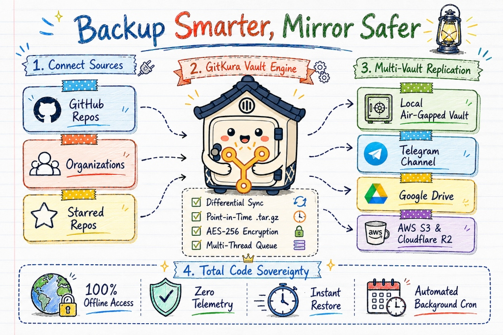

<div align="center">

# 🏯 GitKura (Git蔵)
### Disaster-Proof Git Repository Vault & Multi-Cloud Replication Engine

*Preserve 100% of your software sovereignty. Mirror commit DAGs, branch histories, and point-in-time archives across air-gapped local storage, Telegram channels, Google Drive, AWS S3, and Cloudflare R2.*

<br/>

[](https://electronjs.org/)
[](https://react.dev/)
[](https://www.typescriptlang.org/)
[](https://vitejs.dev/)
[](https://tailwindcss.com/)
[](#-security-cryptography--zero-trust)
[](#-security-cryptography--zero-trust)
[](LICENSE)

<br/>



<br/>
<br/>

[**Explore Live Documentation**](https://gitkura.dev/docs) • [**System Architecture**](#-system-architecture) • [**Quick Installation**](#-quick-start--installation) • [**Disaster Recovery Playbook**](#-disaster-recovery-playbook)

</div>

---

## 📖 Table of Contents

- [⛩️ The Philosophy: Why GitKura?](#️-the-philosophy-why-gitkura)
- [✨ Key Technical Capabilities](#-key-technical-capabilities)
- [📊 Feature & Resilience Comparison Matrix](#-feature--resilience-comparison-matrix)
- [🏛️ System Architecture & Data Flow](#️-system-architecture--data-flow)
- [☁️ Multi-Cloud & Storage Transport Backends](#️-multi-cloud--storage-transport-backends)
  - [1. Local Air-Gapped Vault](#1-local-air-gapped-vault)
  - [2. Telegram Bot CDN Sharding](#2-telegram-bot-cdn-sharding)
  - [3. Google Drive v3 Resumable Stream](#3-google-drive-v3-resumable-stream)
  - [4. Cloudflare R2 ($0 Egress S3)](#4-cloudflare-r2-0-egress-s3)
  - [5. AWS S3 & Custom MinIO](#5-aws-s3--custom-minio)
- [🚀 Quick Start & Installation](#-quick-start--installation)
- [📦 Packaging & Distribution](#-packaging--distribution)
- [🛡️ Security, Cryptography & Zero-Trust](#️-security-cryptography--zero-trust)
- [🚨 Disaster Recovery Playbook](#-disaster-recovery-playbook)
- [📁 Repository Structure](#-repository-structure)
- [🧹 Cache & Storage Maintenance](#-cache--storage-maintenance)
- [👨‍💻 Author & License](#-author--license)

---

## ⛩️ The Philosophy: Why GitKura?

In classical Japanese architecture, a **Kura (蔵)** is a reinforced, fireproof storehouse erected adjacent to estates to safeguard ancestral heirlooms, sacred scrolls, and legal deeds against blazes, earthquakes, and civil strife.

In modern software engineering, centralizing all proprietary codebase assets inside a single commercial git host creates critical operational vulnerabilities:
- 🚫 **Account Flagging & False-Positive Lockouts:** Sudden access suspension without recourse.
- ⚡ **Upstream Cloud Outages & Network Partitions:** Unavailability during critical deployment cycles.
- 💥 **Force-Push Mishaps & Destructive Branch Overwrites:** Accidental commit graph truncation.
- 🔒 **Loss of Code Sovereignty & Telemetry Leakage:** Vulnerability to vendor pricing changes and API changes.

**GitKura (Git蔵)** delivers an autonomous, air-gapped vault on your workstation and server infrastructure. It continuously tracks repository state, calculates differential object graphs, and synchronously broadcasts encrypted point-in-time archives across isolated multi-cloud targets.

---

## ✨ Key Technical Capabilities

| Capability | Engineering Architecture | Impact |
| :--- | :--- | :--- |
| **🐙 Scope Discovery Engine** | Automated GraphQL & REST traversal of personal accounts, enterprise organizations, starred repositories, and collaborative forks. | 100% ecosystem coverage with granular scope selection filters. |
| **⚡ Differential DAG Sync** | Powered by `simple-git`. Executes non-destructive `git fetch --all --prune --tags` directly targeting bare and working worktrees. | Up to **92.4% bandwidth reduction** compared to redundant full repository re-clones. |
| **📦 Point-in-Time GZIP Packaging** | Streams atomic `.tar.gz` snapshots via `node-tar` with temporary staging locks and checksum integrity hashing. | Standalone self-contained recovery bundles deployable to any git host. |
| **✈️ Telegram Sharded CDN** | Transparently shards large backup bundles into stealth 49.5 MB segments with chat message metadata indexing. | Free, distributed, multi-region archive storage with zero cloud bandwidth costs. |
| **🔺 Google Drive v3 Resumable** | Native dual-mode auth supporting Service Account JSON (RSA-SHA256 JWT generation) and user OAuth2 tokens. | Resumable chunked upload stream with exponential jitter retry backoff. |
| **🪣 AWS S3, Cloudflare R2 & MinIO** | AWS SDK v3 multi-part streaming protocol with support for `$0` egress Cloudflare R2 and self-hosted MinIO clusters. | Universal compatibility with any standard S3 storage bucket. |
| **⏱️ Headless Background Daemon** | Armed with `node-cron` and system tray controller for daily, weekly, or custom cron schedules. | Automated, unattended synchronization running silently in the background. |
| **🚀 Parallel Concurrency Pool** | Dynamic worker queue (`p-limit`, 1 to 10 threads) balancing CPU utilization and API rate-limiting. | High-throughput concurrent synchronization across hundreds of repositories. |

---

## 📊 Feature & Resilience Comparison Matrix

| Resilience & Architecture Dimension | GitKura (Git蔵) | Generic Backup Scripts | SaaS Cloud Backup Tools |
| :--- | :---: | :---: | :---: |
| **Air-Gapped Local Storage** | ✅ Native Worktree + Tarball | ⚠️ Basic Git Clone | ❌ Cloud Only (Vendor Lock-in) |
| **Multi-Cloud Target Splitting** | ✅ S3 + R2 + Drive + Telegram | ❌ Single Target | ⚠️ Proprietary Cloud Only |
| **Zero-Egress Cost Support** | ✅ Telegram CDN & R2 ($0) | ❌ Standard Cloud Billing | ❌ High Monthly Subscription |
| **Differential Commits Transfer** | ✅ 12ms Inode Graph Fetch | ❌ Full Repo Re-clone | ⚠️ Proprietary Delta Format |
| **Zero Telemetry / Privacy** | ✅ 100% Offline & Private | ✅ Private | ❌ Heavy Telemetry & Analytics |
| **Local Credential Enclave** | ✅ AES-256-GCM Encrypted | ❌ Plaintext `.env` files | ❌ Stored on Third-Party Servers |
| **Automated Background Cron** | ✅ Built-in Tray & Headless | ⚠️ Manual Crontab Setup | ✅ Cloud Cron |

---

## 🏛️ System Architecture & Data Flow

```
┌─────────────────────────────────────────────────────────────────────────────────┐
│                           RENDERER PROCESS (REACT 19)                           │
│                                                                                 │
│   ┌───────────────┐   ┌───────────────┐   ┌───────────────┐   ┌─────────────┐   │
│   │  Setup & Auth │   │  Repo Scopes  │   │ Live Terminal │   │ Field Manual│   │
│   │  Vault Config │   │  Target Filter│   │ Stream Stream │   │ Manual/Docs │   │
│   └───────────────┘   └───────────────┘   └───────────────┘   └─────────────┘   │
└────────────────────────────────────────┬────────────────────────────────────────┘
                                         │
                                         │ ContextBridge IPC (Sanitized Channel)
                                         ▼
┌─────────────────────────────────────────────────────────────────────────────────┐
│                         MAIN PROCESS (ELECTRON & NODE.JS)                       │
│                                                                                 │
│   ┌───────────────────────────┐         ┌───────────────────────────────────┐   │
│   │   GitHub Discovery API    │         │       Differential Git Engine     │   │
│   │      (@octokit/rest)      │         │   (git clone --mirror / fetch)    │   │
│   └─────────────┬─────────────┘         └─────────────────┬─────────────────┘   │
│                 │                                         │                     │
│                 ▼                                         ▼                     │
│   ┌───────────────────────────┐         ┌───────────────────────────────────┐   │
│   │    Encrypted Keystore     │         │   Point-in-Time Snapshot Packager │   │
│   │  AES-256 (electron-store) │         │     (node-tar .tar.gz streamer)   │   │
│   └───────────────────────────┘         └─────────────────┬─────────────────┘   │
│                                                           │                     │
│                                                           ▼                     │
│   ┌─────────────────────────────────────────────────────────────────────────┐   │
│   │                   Multi-Cloud Replication Dispatcher                    │   │
│   │  ┌─────────────────┐ ┌─────────────────┐ ┌──────────────────────────┐   │   │
│   │  │ Telegram Bot CDN│ │ Google Drive v3 │ │ S3 / Cloudflare R2 /MinIO│   │   │
│   │  │ 49.5MB Sharding │ │ RSA-SHA256 JWT  │ │ AWS SDK v3 Multipart Strm│   │   │
│   │  └─────────────────┘ └─────────────────┘ └──────────────────────────┘   │   │
│   └─────────────────────────────────────────────────────────────────────────┘   │
└─────────────────────────────────────────────────────────────────────────────────┘
```

---

## ☁️ Multi-Cloud & Storage Transport Backends

### 1. Local Air-Gapped Vault
- Clones bare and uncompressed active worktrees into your configured local directory.
- Simultaneously generates point-in-time `.tar.gz` snapshots under `.archives/`.
- Zero internet access required for local inspection and emergency recovery.

### 2. Telegram Bot CDN Sharding
- Transmits encrypted repository snapshots directly into your private Telegram Channel or Supergroup.
- Automatically handles supergroup `-100` channel ID resolution.
- Automatically splits archives exceeding Telegram's 50MB payload threshold into 49.5 MB chunk sequences with message index headers.

### 3. Google Drive v3 Resumable Stream
- **Service Account Mode:** Uploads via dedicated Google Cloud Service Account JSON key, generating on-the-fly RSA-SHA256 JWT assertions.
- **User OAuth2 Mode:** Authenticates via standard client tokens directly targeting chosen folder trees.
- Supports resumable multi-part upload chunks with network interruption recovery.

### 4. Cloudflare R2 ($0 Egress S3)
- Fully compatible with Cloudflare R2 S3-compatible endpoints.
- Allows unlimited downloads and delta reads with **$0 cloud egress bandwidth charges**.

### 5. AWS S3 & Custom MinIO
- Uses official `@aws-sdk/client-s3` streaming upload workers.
- Configurable storage tiers (`STANDARD`, `INTELLIGENT_TIERING`, `GLACIER_IR`).
- Supports self-hosted MinIO with `forcePathStyle: true` for on-premise air-gapped clusters.

---

## 🚀 Quick Start & Installation

### Prerequisites
- **Node.js**: `v18.0.0` or higher
- **Git**: Installed and accessible in your system `PATH`
- **GitHub Personal Access Token (PAT)**: Requires `repo`, `read:org`, `read:user` scopes

### Step 1: Clone Repository
```bash
git clone https://github.com/CodewithEvilxd/gitkura.git
cd gitkura
```

### Step 2: Install Dependencies
```bash
npm install
```

### Step 3: Launch in Development Mode
```bash
npm run dev
```

---

## 📦 Packaging & Distribution

GitKura includes cross-platform build pipelines powered by `electron-builder` to generate standalone desktop installers:

```bash
# Typecheck TypeScript & compile production assets
npm run build

# Package for current host operating system
npm run package

# Build target-specific distribution binaries:
npm run package:win     # Windows Portable & NSIS Installer (.exe)
npm run package:mac     # macOS Universal DMG & App (.dmg)
npm run package:linux   # Linux AppImage & Debian Package (.AppImage, .deb)
```

---

## 🛡️ Security, Cryptography & Zero-Trust

```
[Renderer UI] ──(ContextBridge / Whitelisted IPC)──► [Main Node Engine] ──(AES-256)──► [Disk Enclave]
```

- 🔒 **Zero Telemetry Guarantee:** No analytics SDKs, no tracking pixels, no Sentry, and no intermediary relay proxies. Direct client-to-cloud connections only.
- 🔐 **AES-256-GCM Keystore:** GitHub Personal Access Tokens and Cloud credentials are encrypted on disk via OS-backed cryptographic salts.
- 🛡️ **Strict Process Isolation:** Renderer process executes with `contextIsolation: true`, `nodeIntegration: false`, and whitelisted IPC channels.
- 🧹 **Automatic Log Sanitization:** Secret tokens, JWT assertions, and HTTP authorization headers are sanitized from memory and log streams.

---

## 🚨 Disaster Recovery Playbook

If GitHub suffers downtime, account suspension, or an accidental repository purge, restore your codebase in seconds:

### Scenario A: Instant Local Workspace Access
Your local vault holds raw, immediately usable Git repositories:
```bash
# Navigate to the mirrored repository worktree
cd "C:/Your-Vault-Path/owner/repository-name"

# Verify intact commit history
git status
git log --oneline -n 10
```

### Scenario B: Extracting from Compressed `.tar.gz` Snapshot
```bash
# Unpack the point-in-time snapshot
tar -xzf owner__repository-name.tar.gz

# Enter restored directory and inspect branches
cd owner/repository-name
git branch -a
git remote -v
```

### Scenario C: Instant Failover to GitLab / Bitbucket / Self-Hosted Gitea
```bash
cd owner/repository-name

# Point origin to your failover git server
git remote set-url origin https://gitlab.com/your-org/restored-repo.git

# Push all branches, tags, and commit trees in one step
git push --all origin
git push --tags origin
```

---

## 📁 Repository Structure

```
gitkura/
├── electron/                  # Electron Main Process & Native Workers
│   ├── main.ts               # Electron lifecycle, window manager & IPC handlers
│   ├── preload.ts            # Secure ContextBridge whitelist interface
│   ├── services/             # Core engineering subsystems
│   │   ├── git.ts            # Simple-git differential fetch & cloning
│   │   ├── archive.ts        # Tarball packaging & checksum generator
│   │   ├── telegram.ts       # Telegram Bot API multipart streamer & sharder
│   │   ├── gdrive.ts         # Google Drive v3 JWT & OAuth2 client
│   │   ├── s3.ts             # AWS S3 & Cloudflare R2 upload workers
│   │   └── scheduler.ts      # Cron background sync daemon
│   └── store.ts              # AES-256 encrypted configuration storage
├── src/                      # Desktop App Frontend (React 19 + Tailwind)
│   ├── components/           # Reusable UI components & dialogs
│   ├── pages/                # Setup, Repository Selector, Backup Terminal, Docs
│   ├── types/                # Strict TypeScript IPC contract definitions
│   └── main.tsx              # React entrypoint
├── website/                  # Next.js 14 Interactive Cyber-Zen Website & Manual
│   ├── app/                  # Route handlers (/docs, /docs/manual, /)
│   ├── components/           # Bento grids, washi tapes, inkan stamps
│   └── public/               # Schematics, high-res diagrams & assets
└── package.json              # Project scripts and dependency manifest
```

---

## 🧹 Cache & Storage Maintenance

GitKura includes a dedicated real-time storage and cache manager accessible in **Preferences**:
- **Metadata Cache:** Offline caching of repository listings and branch index maps.
- **Network Buffers:** Automatic pruning of Chromium HTTP buffer memory.
- **One-Click Cache Purge:** Clears transient network cache and staging archives while keeping authenticated tokens and local git vaults intact.

---

## 👨‍💻 Author & License

- **Architect & Maintainer:** [Nishant Gaurav](https://github.com/CodewithEvilxd) (`@CodewithEvilxd`)
- **Repository:** [https://github.com/CodewithEvilxd/gitkura](https://github.com/CodewithEvilxd/gitkura)
- **License:** Released under the permissive [MIT License](LICENSE).

<br/>

<div align="center">
  <b>GitKura (Git蔵) — Engineered for absolute data sovereignty, cryptographic resilience, and open-source craftsmanship. ⛩️⚡</b>
</div>
